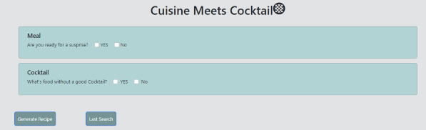
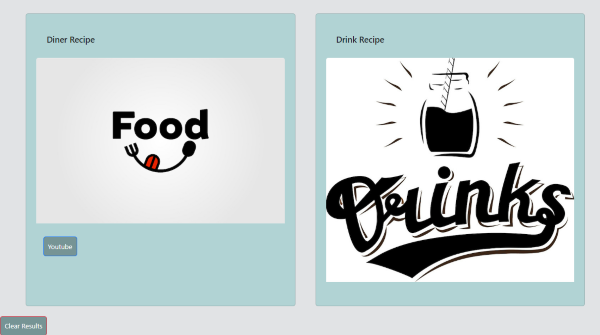
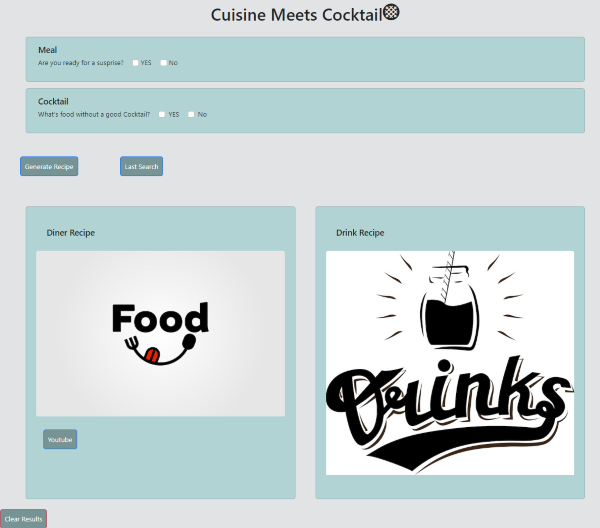

# Meal Meets Cocktails

It's a simple website designed to generate random food and drink recipes fast and easy to cook for adults of any age. 

The main goal of our site is to improve busy people’s quality of life spicing up dinner time with a different meal and drink each day of the week.

## Description

The user interface is designed in a minimalistic way to prevent overwhelming the user and it's easy to use features create an effortless experience for the user.
Our motivation when putting this project together was our own experience as working individuals who want to get home and enjoy a tasty meal without the cost of expensive take out.
As a user I want to be able to enjoy a cocktail along with a meal prepared at the comfort of my own home, avoiding the hassle of searching multiple websites.

## Instructions

Meal Meets Coctails offers two search options, standard search (drink and meal), as well as a dink or meal individualy.

Once you hit search you can visualize a picture of a random drink or meal followed by preparation directions and a YouTube video access (meal recipes only).

## Link

[Meal Meets Cocktails](https://belengigante.github.io/cuisine-meets-cocktails/)

[Meal Meets Cocktails - Github](https://github.com/BelenGigante/cuisine-meets-cocktails/)

## Visuals

